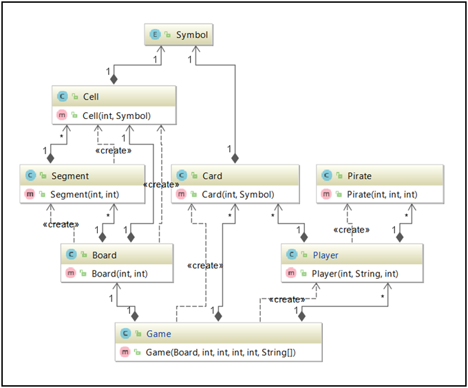
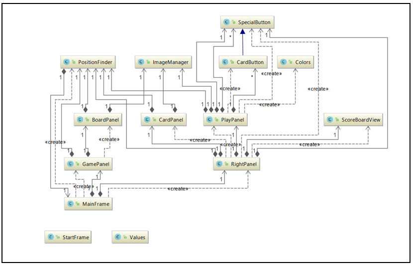

**Introduction**

This project is a Java/Swing application of Cartagena which is a board game.

In this report,         design decisions, UML diagrams and issues will be discussed.

**Design Decisions**

In this section, we will discuss some of our key design decisions.

- ImageManager(Singleton)
- PositionFinder
- Command Pattern
- MVC Pattern
- SpecialButton

**ImageManager(Singleton)**

When singleton instance created,  all images which included in the game once is loaded ImageManager Class. With the help of the singleton method, it&#39;s possible to access that class statically from everywhere. View classes can take this images without any reload with using ImageManager&#39;s functions.
s
Card and Symbol images are held as HashMap, segment images are held as one-by-one.

**PositionFinder**

After our implementation starts,  it becomes more and more obvious that classes are doing a lot of size and dimensions calculations. Because of that, we think that it can be better to handle all this calculation operation in one class.

That class takes Game and MainFrame as parameters after their receiving calculation calls it does the calculations according to MainFrame and its components then return the results.

**Command Pattern**

In Cartagena,  there is mainly 3 move option and their results are different. However, all the options apply to the Game class. With encapsulating all these three options in our Command Interface,  for the purpose of facilitating the communication with ServerSocket and facilitate all actions performed in a single place.

**MVC Pattern**

Before our implementation starts,  we notice that MVC Architectural Design pattern suits very well to our project because we need client interactions and a UI. That pattern also benefits us to work more comfortable on the project.

**SpecialButton**

In this project, some buttons include images and background color. SpecialButton extends JButton and it was created for the purpose of creating these type of buttons more easier. Also CardButton class extends SpecialButton class and this class contains a Card object.

**Model UML Diagram**

**View UML Diagram** 

**Issues**

In this section, issues which are not solved yet will be discussed. 

**Network**

In the Network section, there are 2 different mains that are Server and Client.

Current Situation,

•    The server can create its ServerSocket on locally.

•    Clients can join the game with entering their name and ServerIP.

•    After all players connect to the server, the game will automatically start and players can play successfully to the end of the game.

However, this Network actions performed on separate mains. They must be handled in one main as Threads. There is no trouble about the gameplay over the network, but it is a bad design choice which should be handled.

Asaf Koray BOLAT / Berk ÜĞÜDÜR